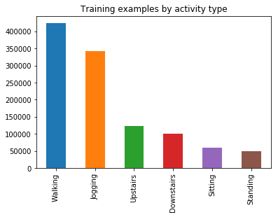

# Human Activity Recognition from different datasets

Human Activity recognition using 1D Convolutional Neural Network for different datasets

# Dataset

  - **HASC**
  - **WISDM**
  - **SinlgeChest**

# Tools

- **Jupyter Notebook**

# 1D CNN Model
```sh
model = Sequential()
model.add(Conv1D(filters=64, kernel_size=3, activation='relu', input_shape=(n_timesteps,n_features)))
model.add(Conv1D(filters=64, kernel_size=3, activation='relu', padding = 'same'))
model.add(Dropout(0.4))
model.add(MaxPooling1D(pool_size=2))
model.add(Flatten())
model.add(Dense(100, activation='relu'))
model.add(Dense(n_outputs, activation='softmax'))
```

# Description
- **Activity Types** for **HASC** dataset


- **Activity plot** for **WISDM** dataset


- **Activities** for **SingleChest** dataset


- **Confusion Matrix** using **CNN** for **HASC** dataset


- **Confusion Matrix** using **CNN** for **WISDM** dataset


- **Confusion Matrix** using **CNN** for **SingleChest** dataset

